## Angular 2 + TypeScript

# Welcome

Note: Thank you Java Basel for organizing this. It's important to do tech events in Basel to strengthen it as a tech place.

----

### Angular 2 - a new Framework

http://angular.io

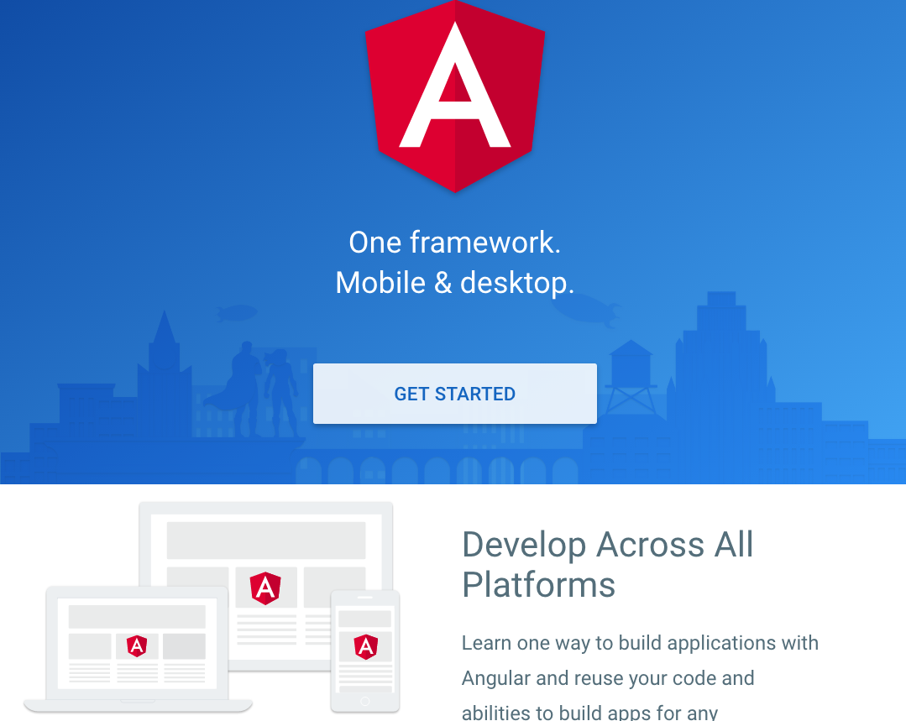

Note: Question - who tried out Angular 2. "Did you like it?"

----

### TypeScript - JavaScript that scales

  

    

      
    

    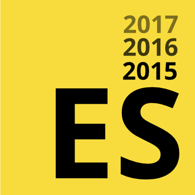
  

  

----

## Hi - I'm Jonas...

@wingsuitist

#### ... I love to learn, develop and teach

---

## Let's build something

1. The Idea: *Push Basel Tech*
2. The Plan: *We need a Member "App"*
3. Let's Implement: *Build it with Angular2*

----

### Basel Tech

----

## Take it apart

----

## Component Tree

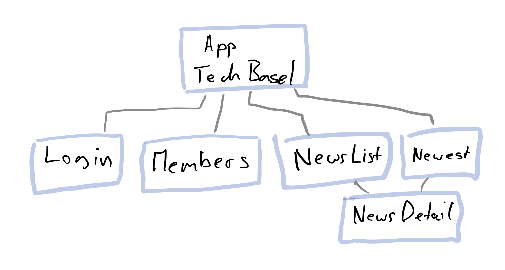

----

## Single Component

----

## Services

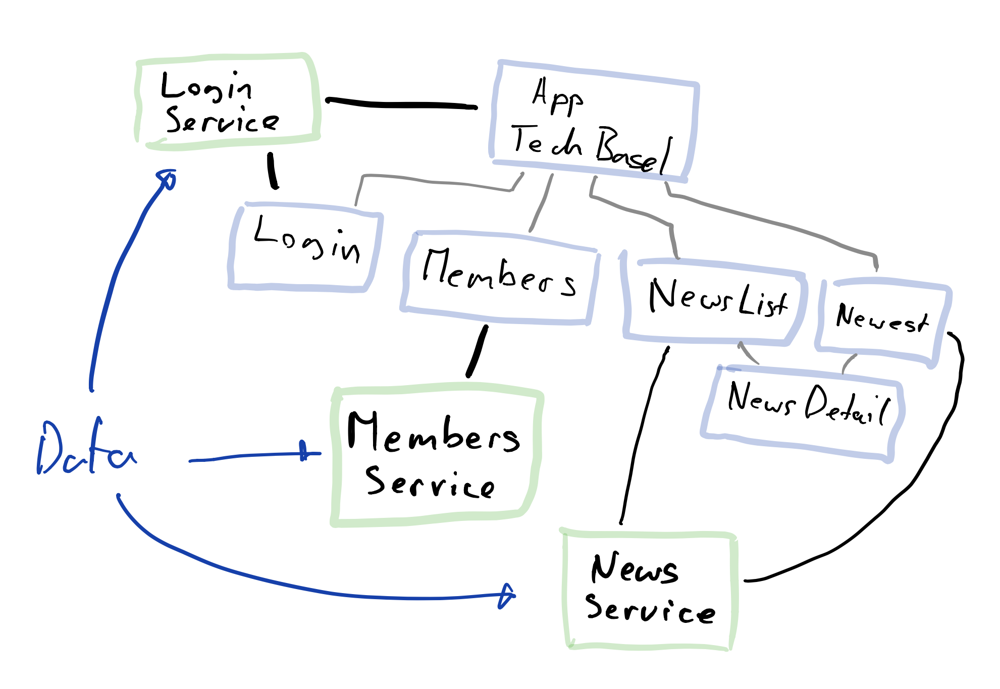

----

## Overview

---

## Let's start

*Angular-cli => Commandline Helper*

*Setup, Generate, Build, Serve, Test, Deploy*

1. Install node: https://nodejs.org/en/download/
3. Install angular-cli: `npm install -g angular-cli`
4. Editor: `Atom, Visual Studio Code, Webstorm`

----

#### New Angular 2 App

`ng new baseltech`

----

#### Run and test

`ng serve`

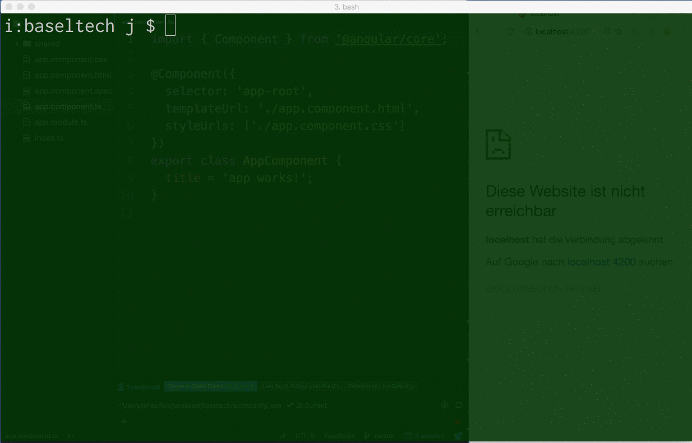

----

#### Generate and use Components

`ng generate component login ...`

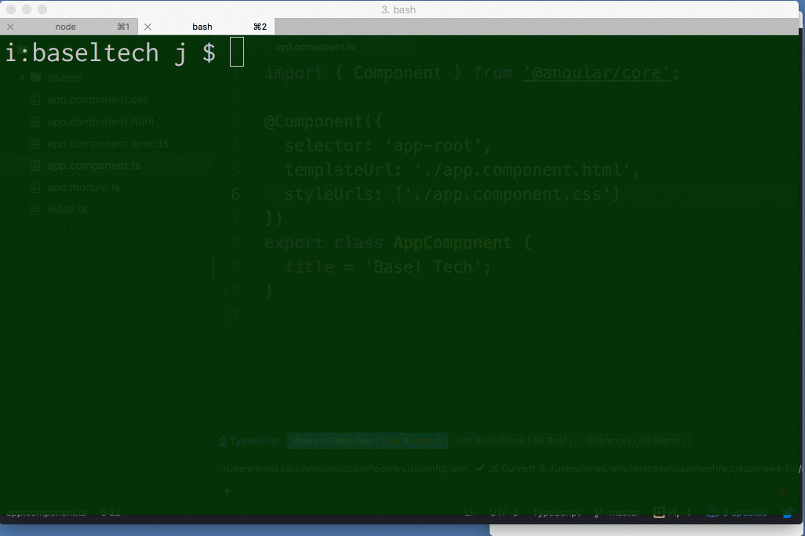

----

#### News Detail "Sub"-Component

----

#### Generate Services

`ng generate service shared/login`

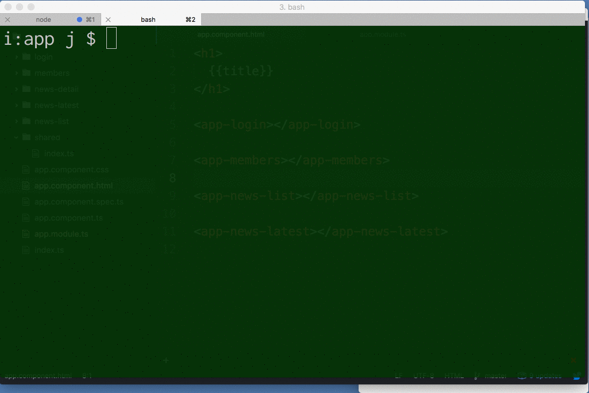

----

#### Login

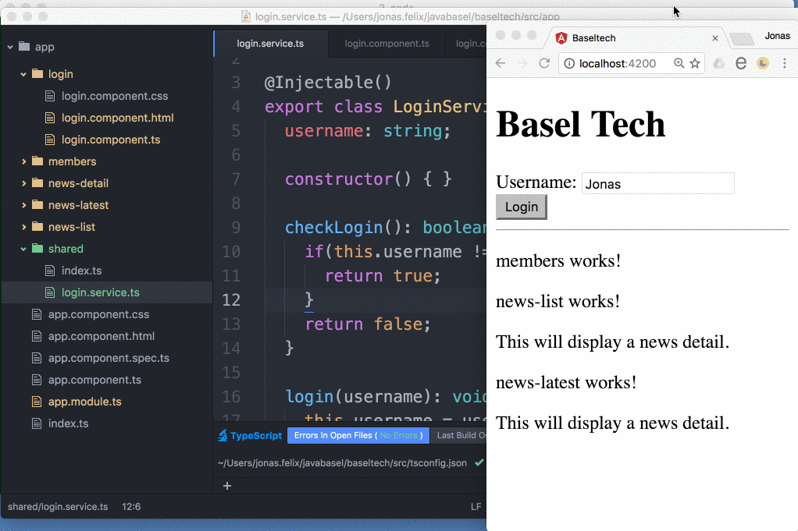

----

#### Permissions

----

#### List News

`ng generate service shared/news`

----

#### News Detail

`ng generate service shared/news`
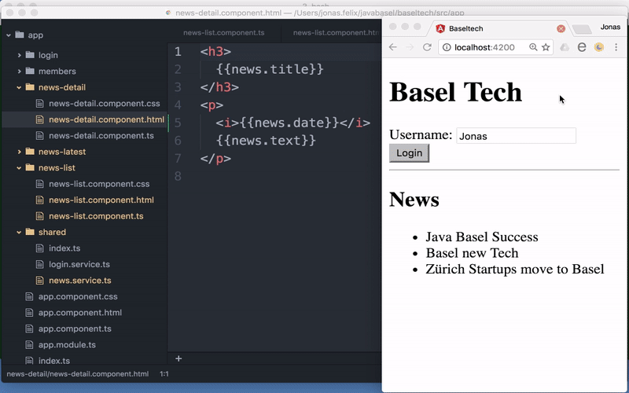

----

#### News Latest

`ng generate service shared/news`

---

#### Nice and structured

----

#### That's Angular 2

----

#### As Single Page Application

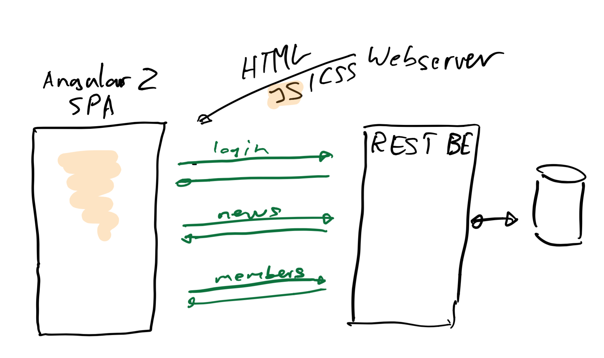

----

#### As App - Ionic2

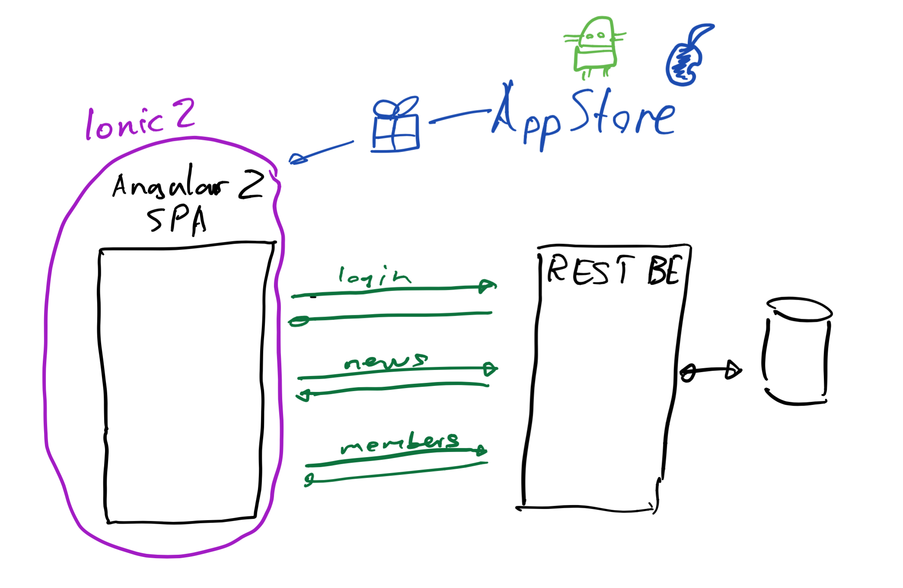

*On desktop with Electron like Visual Studio Code*

----

#### As App

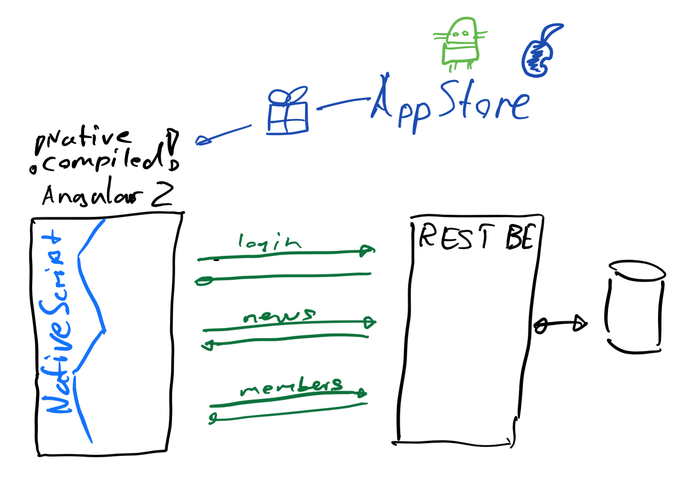

---

### Angular 2 Approach

1. **How do we want to work.**
2. How to enable this in a JS world.

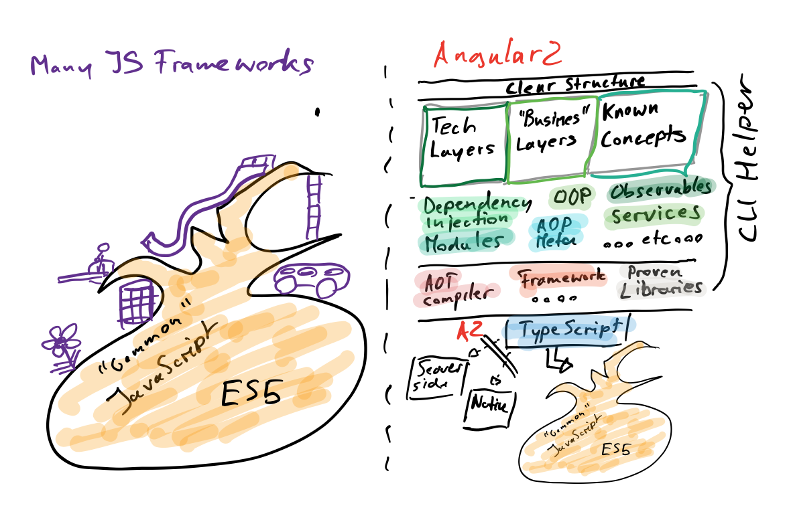

----

### Ecosystem & Tooling from Day 1

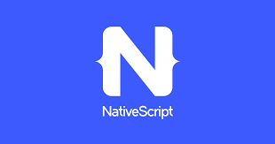

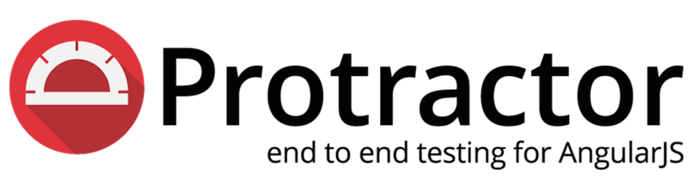

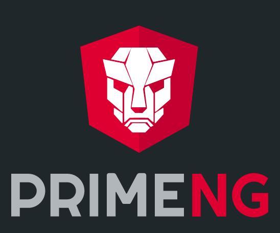
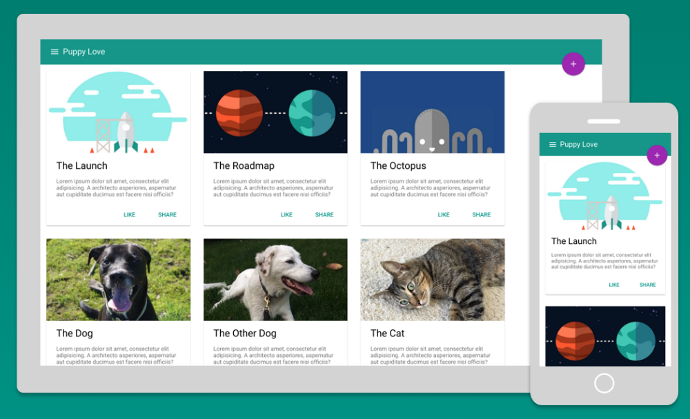
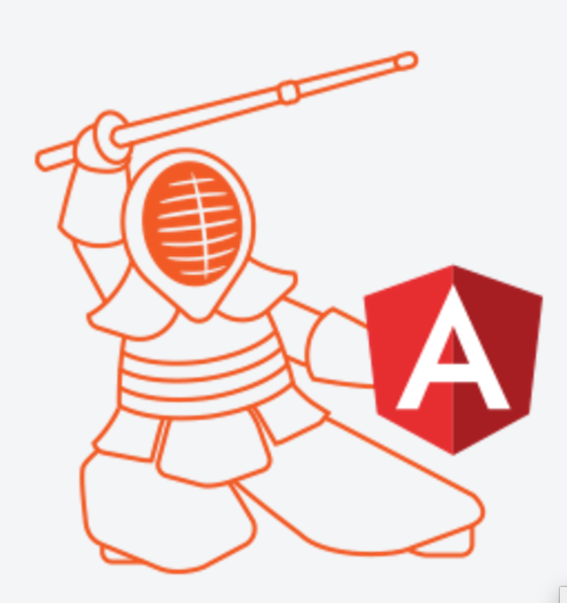
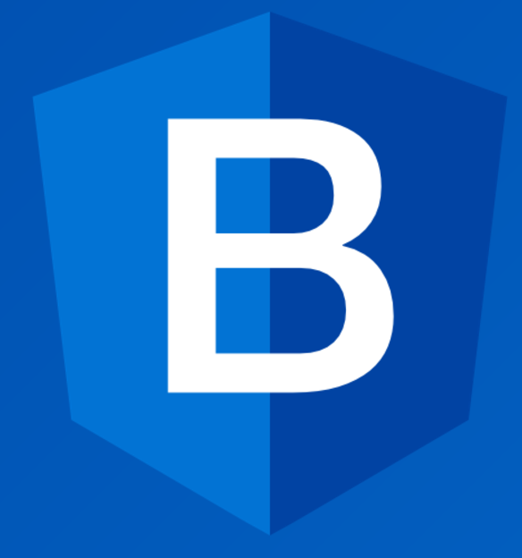

----

### Most important => The force is with it

1. Team: Experienced, Full Time, Proven
2. Backing: Top Companies use it for Core Business

----

#### And....

### It attracts new audiences

* Java Developers
* C# .Net Developers
* ...

*even more than "Web-Frontend-Devs"*

----

## Does it attract you?

---

## Angular 2 Trainings
### www.letsboot.com

 Andreas | Jonas
---|---
 | 
... | @wingsuitist

### Thank you!
